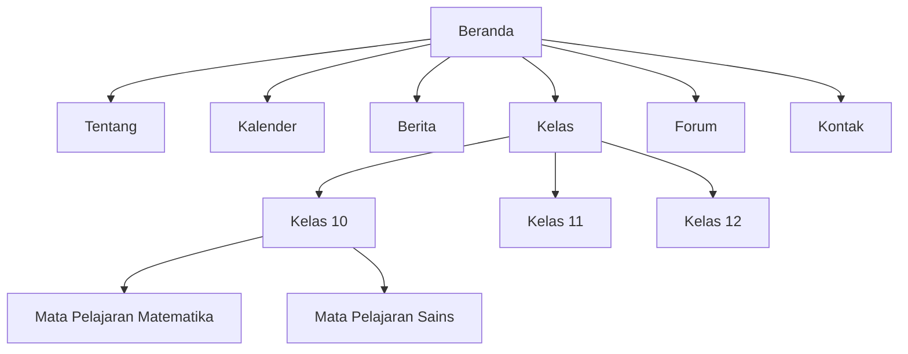

# Rencana Website untuk SMK BHAKTI PACET

## Ringkasan Konsep

Website untuk SMK BHAKTI PACET akan berfungsi sebagai platform komprehensif untuk informasi dan komunikasi, menargetkan siswa, orang tua, dan staf pengajar. Tujuan utama adalah untuk memberikan akses mudah ke informasi sekolah, memfasilitasi komunikasi, dan mendukung kegiatan pendidikan. Tujuan kunci meliputi:

- Menyebarkan informasi yang akurat dan terkini tentang sekolah.
- Memungkinkan interaksi antara siswa, orang tua, dan guru.
- Memastikan aksesibilitas untuk semua pengguna, termasuk mereka yang memiliki disabilitas.
- Mempertahankan antarmuka yang ramah pengguna dan responsif di seluruh perangkat.

Audiens target:

- Siswa: Akses jadwal kelas, tugas, dan pengumuman.
- Orang tua: Memantau kemajuan anak mereka dan acara sekolah.
- Guru: Berbagi sumber daya, berkomunikasi dengan siswa, dan mengelola konten.
- Administrator: Memperbarui konten dan mengelola situs.

## Rincian Fitur Utama

### 1. Halaman Beranda

- **Fungsi**: Menampilkan informasi umum tentang sekolah, termasuk pesan selamat datang, berita unggulan, acara mendatang, dan tautan cepat ke bagian kunci.
- **Dukungan UI**: Banner hero dengan logo sekolah dan tagline, tata letak grid untuk konten unggulan, tombol ajakan bertindak untuk navigasi. Mendukung akses cepat ke pengumuman dan kalender.

### 2. Halaman Profil Sekolah

- **Fungsi**: Memberikan informasi rinci tentang sejarah sekolah, misi, visi, fakultas, dan fasilitas.
- **Dukungan UI**: Bagian terstruktur dengan heading, gambar fasilitas, dan akordeon yang dapat diperluas untuk konten rinci. Termasuk galeri foto dan tautan kontak.

### 3. Kalender Acara

- **Fungsi**: Mendaftar semua acara sekolah mendatang, liburan, dan tanggal penting. Memungkinkan pengguna melihat berdasarkan bulan dan menambahkan acara ke kalender pribadi.
- **Dukungan UI**: Widget kalender interaktif dengan detail hover, opsi filter berdasarkan kategori (misalnya, akademik, ekstrakurikuler). Ramah mobile dengan navigasi geser.

### 4. Pengumuman dan Berita

- **Fungsi**: Menerbitkan berita terkini, pengumuman, dan pembaruan. Termasuk kategori seperti akademik, administratif, dan pencapaian siswa.
- **Dukungan UI**: Tata letak gaya blog dengan fungsi pencarian dan filter, gambar unggulan, dan paginasi. Integrasi feed RSS untuk pelanggan.

### 5. Halaman Kelas dan Mata Pelajaran

- **Fungsi**: Halaman khusus untuk setiap tingkat kelas dan mata pelajaran, berisi silabus, sumber daya, tugas, dan informasi kontak guru.
- **Dukungan UI**: Navigasi hierarkis dengan breadcrumb, file yang dapat diunduh, dan video tersemat. Otentikasi pengguna untuk konten khusus siswa.

### 6. Forum Komunikasi

- **Fungsi**: Papan diskusi untuk siswa dan guru untuk bertanya, berbagi ide, dan berkolaborasi dalam proyek.
- **Dukungan UI**: Diskusi berulir dengan profil pengguna, alat moderasi, dan fungsi pencarian. Desain responsif untuk partisipasi mobile.

### 7. Informasi Kontak dan Lokasi

- **Fungsi**: Mendaftar detail kontak untuk staf, alamat sekolah, dan integrasi peta.
- **Dukungan UI**: Formulir kontak untuk pertanyaan, Google Maps tersemat, dan direktori terorganisir dengan foto dan peran.

### 8. Sistem Pendaftaran Online

- **Fungsi**: Memungkinkan calon siswa mendaftar online, mengirimkan aplikasi, dan melacak status.
- **Dukungan UI**: Formulir multi-langkah dengan validasi, integrasi pembayaran aman jika diperlukan, dan email konfirmasi.

### 9. Integrasi Media Sosial

- **Fungsi**: Tautan ke akun media sosial resmi untuk keterlibatan yang lebih luas.
- **Dukungan UI**: Feed tersemat atau tombol berbagi di halaman relevan, memastikan konsistensi konten.

## Prototipe Desain atau Mockup

### Struktur Tata Letak

- **Header**: Logo, menu navigasi, bilah pencarian, dan status login pengguna.
- **Konten Utama**: Sistem grid fleksibel (misalnya, 12-kolom) untuk desain responsif.
- **Sidebar**: Untuk navigasi sekunder, postingan terkini, atau tautan cepat.
- **Footer**: Hak cipta, tautan tambahan, dan ikon media sosial.

### Skema Warna

- Primer: Biru navy (#003366) untuk header dan tautan, mewakili kepercayaan dan profesionalisme.
- Sekunder: Putih (#FFFFFF) untuk latar belakang, abu-abu terang (#F0F0F0) untuk bagian.
- Aksen: Emas (#FFD700) untuk sorotan dan tombol.

### Font

- Heading: Font sans-serif seperti Arial atau Roboto untuk keterbacaan.
- Body: Sans-serif bersih (misalnya, Open Sans) untuk teks body, memastikan kontras tinggi (hitam pada putih).

### Pertimbangan Aksesibilitas

- Kepatuhan WCAG 2.1 AA: Teks alt untuk gambar, navigasi keyboard, kontras warna yang cukup (rasio 4.5:1), dan dukungan pembaca layar.
- Breakpoint responsif: Desktop (>1024px), tablet (768-1023px), mobile (<768px).
- Contoh mockup berbasis teks:

```
[Header: Logo | Menu: Beranda Tentang Kalender Berita Kelas Forum Kontak]
[Banner Hero: Selamat Datang di SMK BHAKTI PACET]
[Grid: Berita Unggulan | Acara Mendatang | Tautan Cepat]
[Footer: Info Kontak | Tautan Sosial]
```

### Diagram Mermaid untuk Alur Halaman



## Struktur Navigasi

- **Menu Utama**:

  - Beranda
  - Tentang Kami
    - Sejarah
    - Fakultas
    - Fasilitas
  - Kalender
  - Berita & Pengumuman
  - Kelas & Mata Pelajaran
    - Berdasarkan Kelas (10, 11, 12)
    - Berdasarkan Mata Pelajaran
  - Forum
  - Kontak
  - Login/Daftar

- **Navigasi Breadcrumb**: Pada halaman sub untuk kembali dengan mudah.
- **Fungsi Pencarian**: Bilah pencarian global di header.

## Rencana Teknis dan Hosting

- **Teknologi Stack**: HTML5, CSS3, JavaScript untuk frontend; PHP atau Node.js untuk backend jika fitur dinamis diperlukan. Gunakan CMS seperti WordPress untuk manajemen konten yang mudah.
- **Responsivitas**: Bootstrap atau media query CSS kustom.
- **Keamanan**: HTTPS, enkripsi data, otentikasi pengguna dengan peran (siswa, guru, admin), audit keamanan rutin.
- **Pembaruan Konten**: Panel admin untuk staf non-teknis memperbarui konten tanpa coding.
- **Hosting**: Hosting bersama sederhana (misalnya, via Hostinger atau serupa) dengan domain seperti smkbhaktipacet.sch.id. Layanan backup dan pemantauan.
- **Pemeliharaan**: Pembaruan rutin ke konten, patch keamanan, dan pemantauan performa.

Rencana ini memastikan website berfungsi, dapat diakses, dan dapat diskalakan. Konten harus ditinjau secara rutin untuk akurasi.
